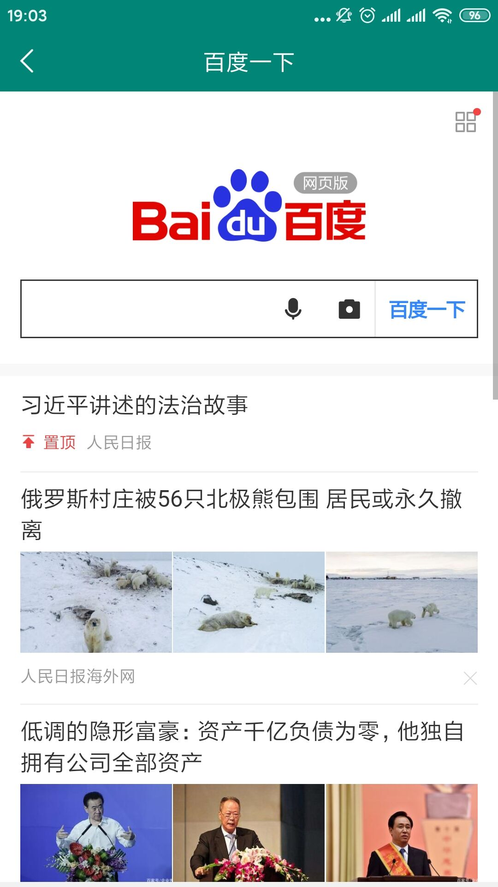

# Web
快速打开一个Web连接页面。
### 引入

```
allprojects {
		repositories {
			...
			maven { url 'https://jitpack.io' }
		}
	}

android {
    ...
    defaultConfig {
        ...
        // 不要改这里
        ndk {
            abiFilters "armeabi", "armeabi-v7a", "x86", "mips"
        }
    }
}

implementation 'com.github.wenkency:web:1.1.0'

```

### 使用方式
```
public class MainActivity extends AppCompatActivity {

    @Override
    protected void onCreate(Bundle savedInstanceState) {
        super.onCreate(savedInstanceState);
        setContentView(R.layout.activity_main);
        // 修改默认配置
        WebConfig.getInstance().setProgressHeight(5);
        // 修改进度条颜色
        WebConfig.getInstance().setProgressDrawable(R.drawable.progress_bar_test);

        // 添加JS交互事件
        WebConfig.getInstance().setJSName("WebEvent");
        WebConfig.getInstance().setEvent(new WebEvent());
    }

    public void web(View view) {
        // 使用方式
        WebUtils.getInstance().startWebActivity(this, "https://dev-h5.car-house.cn/supplier/articles");
    }
}
```

### 运行结果


